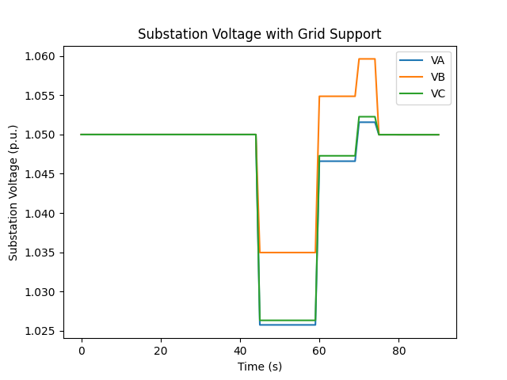

# 13-Bus for Grid Support v1

## Transmission equivalence
The transmission system is represented as an equivalent impedance and source as seen from the distribution system, 
downstream of any transformer or regulator. 
It is modeled as a 1.05 pu source behind a 0.4j Ω impedance bypassed by low impedance switches. The closed 
switches 
simulate normal operation. Opening a switch results in a lower voltage at the substation due to the higher source 
impedance. (The two switches with a node between is necessary for GridLAB-D since it does not allow two links 
between the same nodes.)
## Microgrids
Three identical simple microgrids (MGs) are attached with switches as shown in the image. A short line connects the 
PCC to a central node and two longer, symmetrical, lines branch out to a load bus and a bus with inverter based 
resources (shown in green).

## Distribution System
The distribution system is a slightly modified IEEE 13-bus system. For simplicity, the loads are all converted to wye 
connected, constant PQ, spot loads. The bus numbers have also been renumbered, the image shows the new bus numbers in bold with the old bus names also 
shown.
To simulate the distributed load, a node is added between 1/4 the way down the line between 632 and 671 (2 and 6) 
having 2/3 of the total distributed load. 1/3 of the distributed load is added to node 671 (6). See p. 56 of 
"Distribution System Modeling and Analysis" by Kersting.
The original 13-bus system also has capacitors at 675 (12) and 611 (9). These are added to the loads instead.
## Details
* The description of each branch is found in branchdata.csv.
  * Impedances are in p.u. on the base specified.
* The description of each bus, load, etc. is found in powerdata.csv.
  * Columns PgA, PgB, and PgC specify the rated real power for the inverter on that phase. The apparent power rating is 
    1.2 times that value.

## Demonstration Model
* Run the GridLAB-D model, demonstration.glm to get a simple demonstration. 
  * The bypass switch opens at t=45s to cause the voltage drop.
  * Player files specify the reactive power output of the inverters as shown in the table below.
  
| time (s) | Q (kVar) |
|----------|----------|
| 0        | 0        |
| 60       | 100      |
| 70       | 125      |
| 80       | 150      |

  * Real power output of inverters is set to 90kW per phase.
  * The resulting substation voltage is shown in the plot below.

